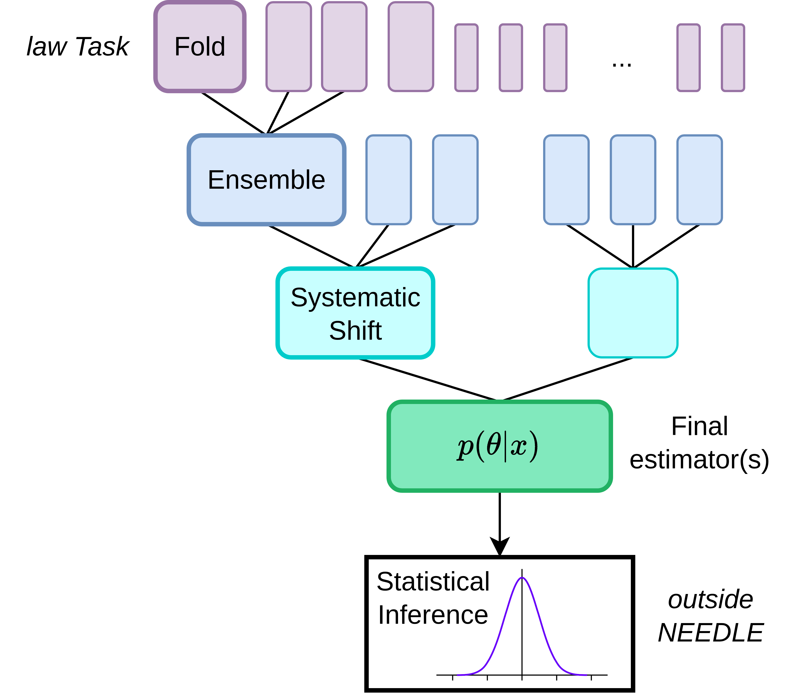

LAW Tasks
=========

Law Tasks are at the core of how NEEDLE organizes the training of your models. Since NSBI methods typically
rely on a combination of several neural networks, NEEDLE allows for a flexible graph building for
systematics, ensembling and cross-fold validation. Each layer of the Task graph gets its own Law Task.
The structure of the graph funnels from Folds down to a single MainTask.

Core Tasks
----------

.. toctree::
   :maxdepth: 2

   MainTask
   EstimatorTask
   SystematicTask
   EnsembleTask
   FoldTask
   SnapshotTask
   DownstreamTask

Mixins
------

.. toctree::
   :maxdepth: 2

   mixins/index

Workflows
---------

.. toctree::
   :maxdepth: 2

   workflows/index
