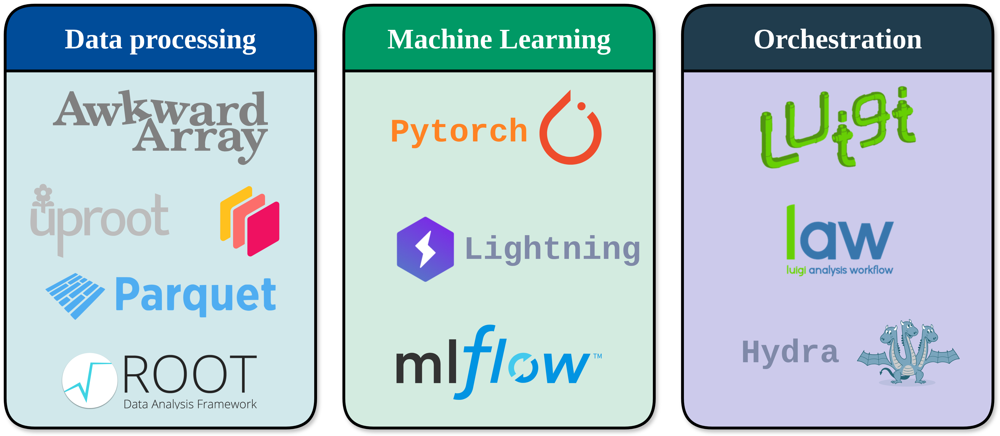

# NEEDLE

**NEEDLE** is a workflow orchestrator for HEP machine learning pipelines, combining
[LAW](https://law.readthedocs.io/en/latest/) task scheduling,
[Lightning](https://lightning.ai/docs/pytorch/stable/) training modules, and
[Hydra](https://hydra.cc/docs/intro/) configuration management.

---

::::{grid} 2
:gutter: 3

:::{grid-item-card} Setup
:link: setup/index
:link-type: doc

Installation, environment variables, running your first task, and troubleshooting.
:::

:::{grid-item-card} Concepts
:link: concepts/task_hierarchy
:link-type: doc

The task DAG, Hydra config system, and how to write downstream analysis tasks.
:::

:::{grid-item-card} Examples
:link: examples/fair_universe_demo/index
:link-type: doc

End-to-end example: FAIR Universe HiggsML demo with normalizing flows and classification.
:::

:::{grid-item-card} API Reference
:link: api/index
:link-type: doc

Auto-generated reference for all public modules.
:::

::::

## Libraries

The data-processing libraries are completely optional and are only used when selecting the NEEDLE
Lightning Datamodules in your config. For the training and inference, pytorch Lightning is a key
component that ensures models are compatible with the framework. Finally, we use law (a fork of
Spotify's luigi) to schedule and organize Tasks.



---

```{toctree}
:maxdepth: 2
:caption: Getting Started
:hidden:

setup/index
```

```{toctree}
:maxdepth: 2
:caption: Concepts
:hidden:

concepts/task_hierarchy
concepts/law_tasks
concepts/lightning_and_hydra_integration
concepts/hydra_config
concepts/downstream_tasks
concepts/dask_awkward
```

```{toctree}
:maxdepth: 2
:caption: Examples
:hidden:

examples/fair_universe_demo/index
```

```{toctree}
:maxdepth: 2
:caption: NEEDLE API
:hidden:

api/index
```
